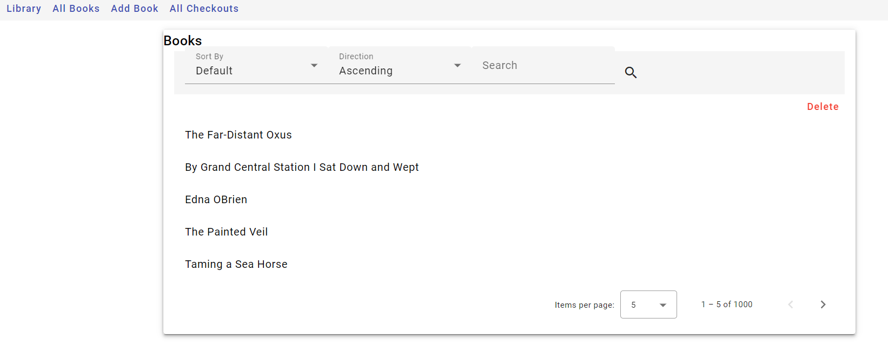
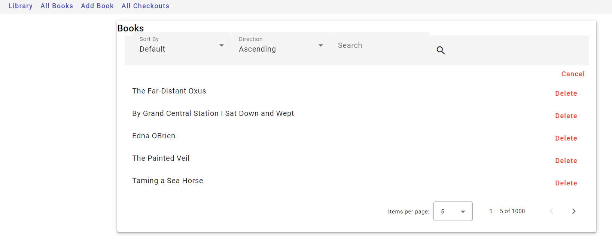
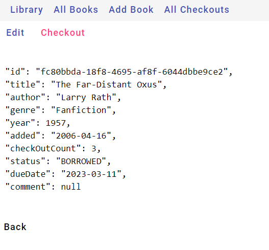
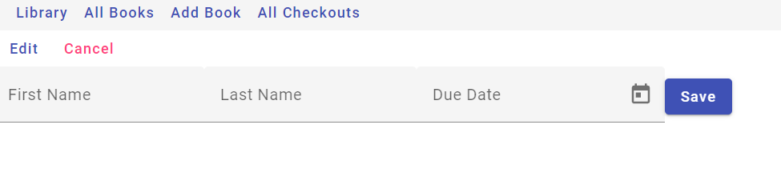
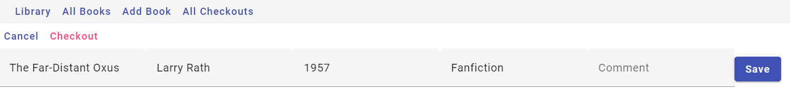
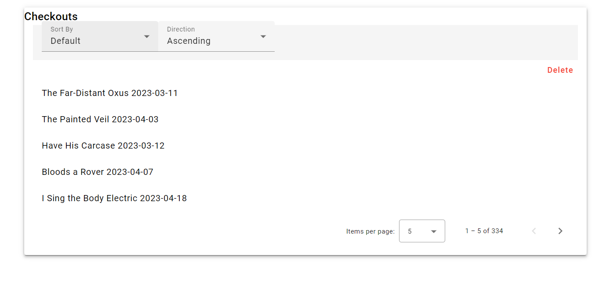
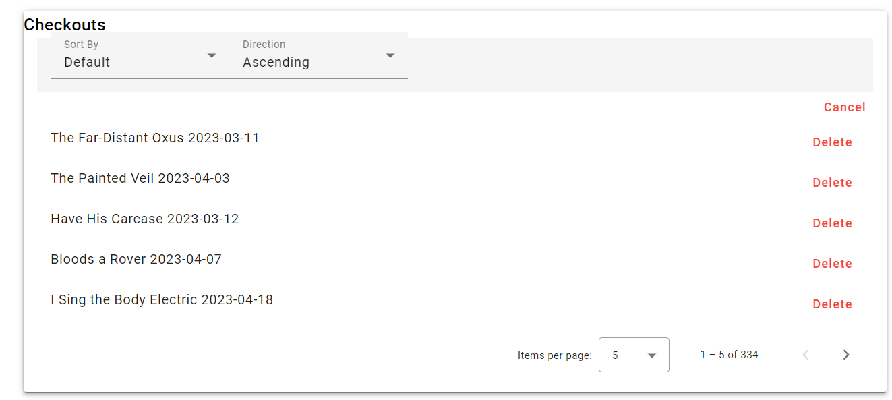
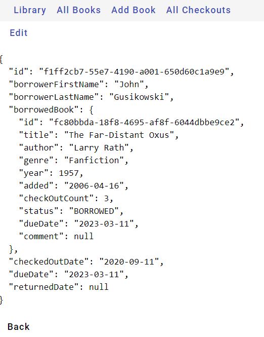
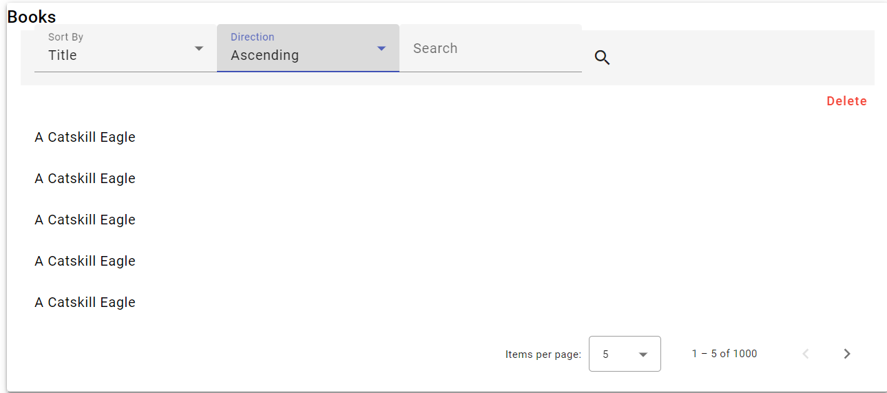
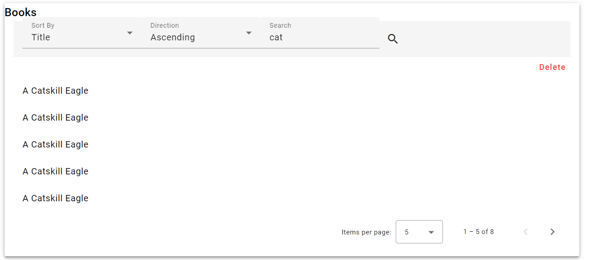

## Functionality that has been implemented
* Using backend api endpoint /getBooks, implement table of books view `(It was done by task developer)`
* Using checkout api endpoint /getBooks, implement table of checkout view `(done)`
* BookView pagination `(done)`
* BookView sorting by title or author + direction `(done)`
* Checkout pagination `(done)`
* Checkout sorting by title or author + direction `(done)`
* Book CRUD implementation `(done)`
* Checkout CRUD implementation, also when create/delete/update changed book status and due date`(done)`
* Implement searching for books using freetext criteria + you can also sort and change direction of the result  `(done)`

#### Some notes:
 
 - to get accesses to edit book or create checkout of this book, press directly on book title and make chore you not in delete mode

### Book view + delete

### Checkout create

### Book create

### Book edit

### Checkout view

### Checkout edit + delete

### Sorting + direction

### Search

## Challenges

- The hardest part was learning Angular and TypeScript from scratch. Because previously I had no experience with this framework and language, and in general, not particularly worked with the front end. 
- Complete someone else's code. As it often happens it is much easier to write from scratch than to supplement existing code.
- My personal challenge, because of the study and work I could not devote as much time to this task as I wanted, also did not have time to do everything I wanted :')
- Also felt the lack of description of the application, what its essence and the interaction of objects with each other. 
- Also, I have not worked with the built-in database given SpringBoot (before that was the experience of creating a local database of the type PostgreSql or MySql). Which also took me a while to figure out.

## Personal experience
- Despite all the challenges, I really enjoyed working on this assignment. This is different from what I usually do, often in all group projects I am responsible for the back-end and the database. Here I was able to get experience with front-end development, it is always interesting to learn something new. I also discovered some new features of SpringBoot, which was a pleasant discovery for me. Of course, my code is far from perfect, and it has not been clean code at least for the front-end part, but I am very satisfied with the results of my work anyway, considering the possibilities I had. I would very much like to communicate with the person who developed this task :)

